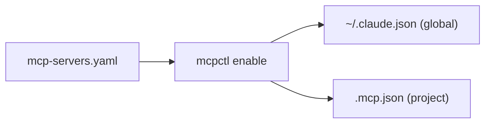

# mcpctl

MCP server manager for Claude Code. Enable, disable, and configure MCP servers from a single YAML registry.

## What it does

- Manage MCP servers across global (`~/.claude.json`) and project (`.mcp.json`) scopes
- Support for npm, Python, Docker, and remote HTTP servers
- Container lifecycle management for Docker-based servers
- Dependency checks before enabling servers
- Dry-run mode to preview config changes
- Atomic config writes with automatic backups

## Quick start

```bash
pip install mcp-ctrl
mcpctl list
mcpctl enable --global memory
mcpctl enable --project diagrams
```

## How it works

mcpctl reads server definitions from `~/.config/mcpctl/mcp-servers.yaml` and writes the resolved config to Claude Code's config files. Each server entry defines its type, command, args, environment variables, and optional dependencies.


